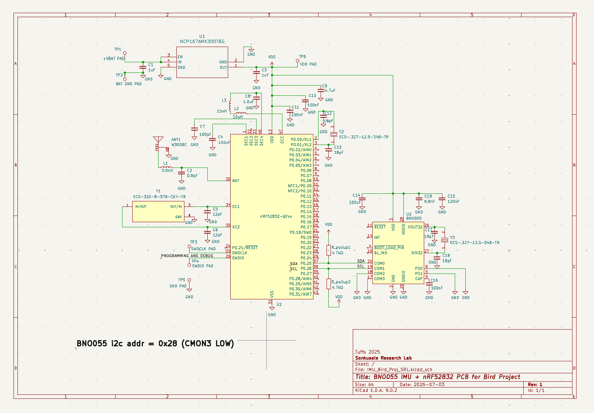
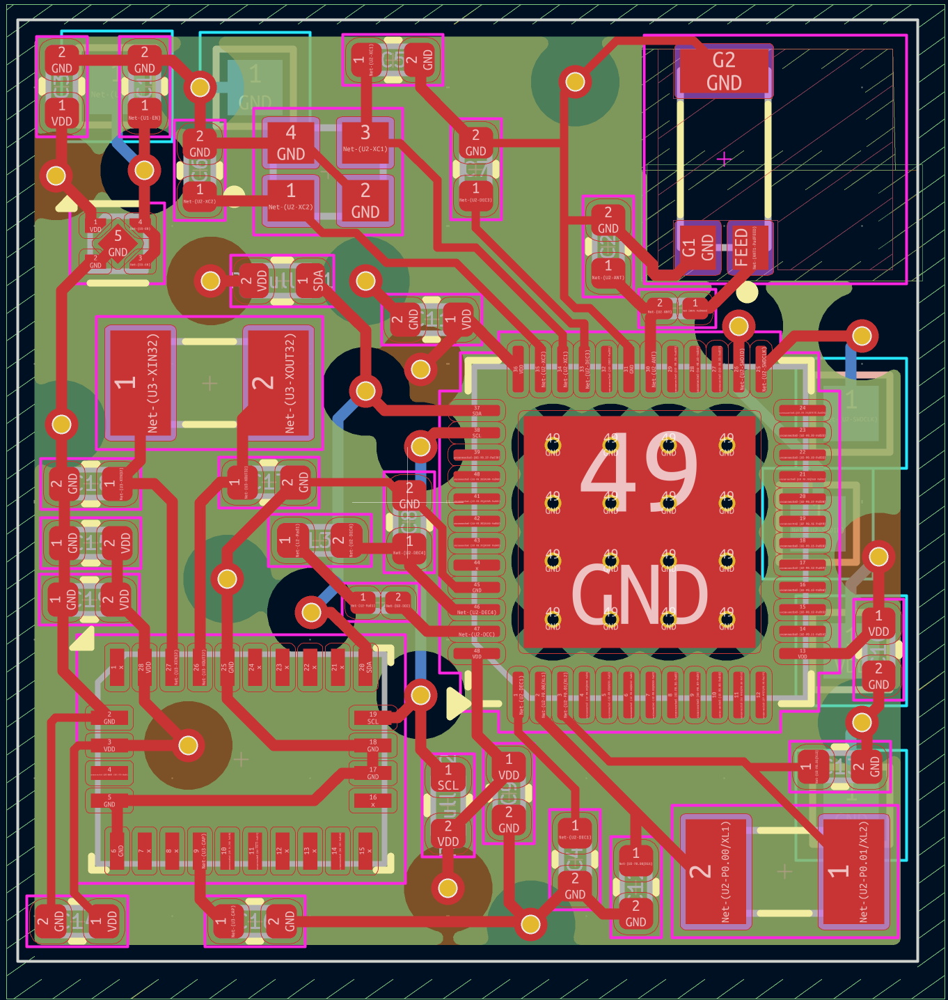

# IMU-Bird-Flight-Monitoring

## Contributors
- **Isaac Medina** - Firmware development, PCB design, digital post processing, and visualization
  - Tufts University Undergraduate - Class of 2027
  - Electrical Engineering

## Institutional Affiliations
This project is conducted as part of ongoing research in the **Sonkusale Research Lab** in collaboration with the **Romero Lab**  

**Tufts University**  
Department of Electrical and Computer Engineering  
Halligan Lab  
Medford/Somerville Campus

## Ackowledgements
I would like to thank [Surya Varchasvi](https://www.linkedin.com/in/surya-varchasvi-d-96496348/), Research Fellow at Tufts University, for his mentorship and guidance throughout this project.  

I would also like to acknowledge [Rachel Riccio](https://www.linkedin.com/in/rachelriccio/), Biology PhD candidate at Tufts University, for her collaboration and ongoing support in applying this technology to real-world behavioral and physiological studies in birds.

Special thanks to [Dr. Sameer Sonkusale](https://engineering.tufts.edu/ece/people/faculty/sameer-sonkusale) for the opportunity to work in the lab.

## Overview
This repository contains firmware, data processing scripts, analysis tools, and a hardware overview for an inertial measurement unit (IMU)-based system designed to track bird flight in three dimensions. The system supports both the BNO055 and LSM6DS3 IMUs, collecting data via embedded microcontrollers and transmitting it wirelessly for post-processing and visualization.

The goal of this project is to reconstruct accurate 3D motion paths of free-moving birds using lightweight, onboard IMU sensors. This enables researchers to monitor flight behavior and subtle movement patterns in a minimally or even non-invasive manner, with applications in ethology, biomechanics, and assessing environmental stress.

**Further Documentation and Details:** [https://drive.google.com/drive/folders/13ZLHDZwBnFIGaNL608wH95rKQjg1W_1H?usp=drive_link](url)

## Project Context
This project is part of a larger, ongoing research initiative that I joined during the Spring 2025 semester at Tufts University, focused on understanding physiological stress responses in birds. The broader research aims to develop a noninvasive framework for monitoring both behavioral and physiological markers of stress in birds. By combining IMU-derived flight data with additional physiological data (e.g., heart rate, hormone levels), the project contributes to a growing field of ecophysiological monitoring technologies.

## Features
- Real-time data collection from 6-DoF and 9-DoF IMUs (LSM6DS3 and BNO055) --> 9-DoF BNO055 for final implementation
- Embedded system design for data logging and wireless transmission via BLE using nRF52832 
- Python scripts for filtering, integration, and 3D trajectory reconstruction
- Kalman Filter and Zero-Velocity Update (ZUPT) algorithms to reduce drift  gg
- Modular architecture to support sensor replacement and system scaling

## Hardware Design 

<table>
  <tr>
    <td></td>
    <td></td>
  </tr>
</table>
<table>
  <tr>
    <td></td>
    <td></td>
  </tr>
</table>

## Software Design - Digital Post Processing

## Repository Structure
- **BNO055**
  - Data Collection Code ESP32 --> Contains ESP32 Arduino code for logging output data from BNO055 9-DoF IMU
  - Datasets --> Contains raw CSV data logs
  - Figures --> Contains output figures from data analysis, such as position plots and state outputs
  - BNO055_Position_v1.py --> Initial simple algorithm for BNO055
  - BNO055_Position_v2.py --> First Kalman filter and ZUPT algorithm implementation
  
- **Images**
  - Contains various images related to the project, such as block diagrams, PCB designs, and miscellaneous pictures.

- **LSM6DS3**
  - Data Collection Code ESP32 --> Contains ESP32 Arduino code for logging output data from LSM6DS3 6-DoF IMU
  - Datasets --> Contains raw CSV data logs
  - Figures --> Contains output figures from data analysis, such as position plots and state outputs
  - IMU_to_Position1.py --> First algorithm code for POC

